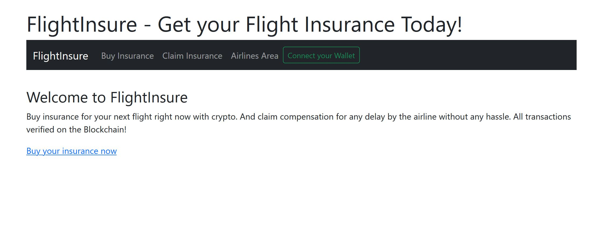
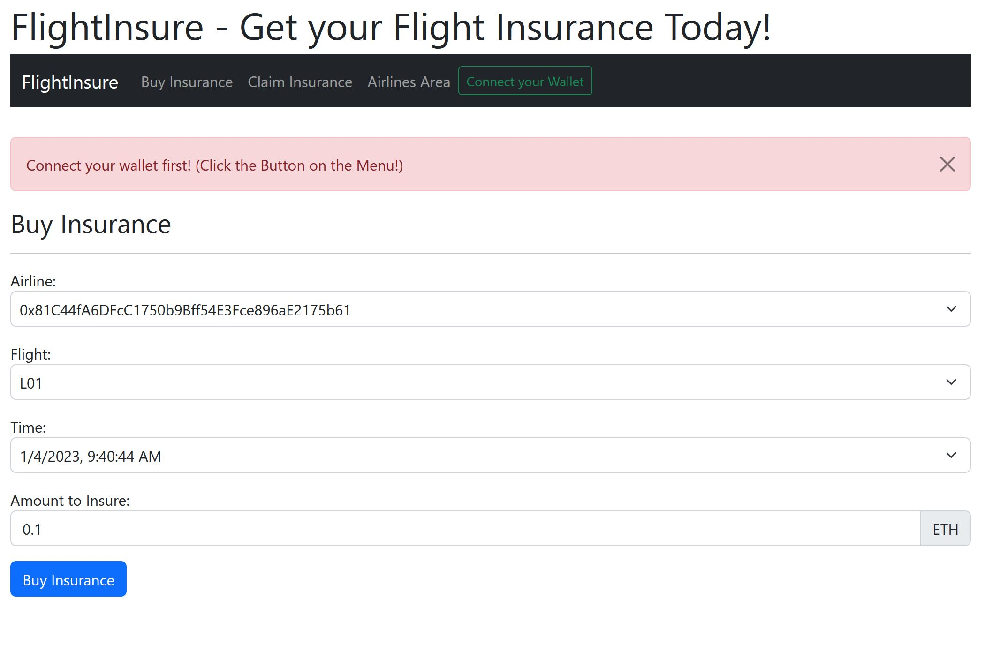
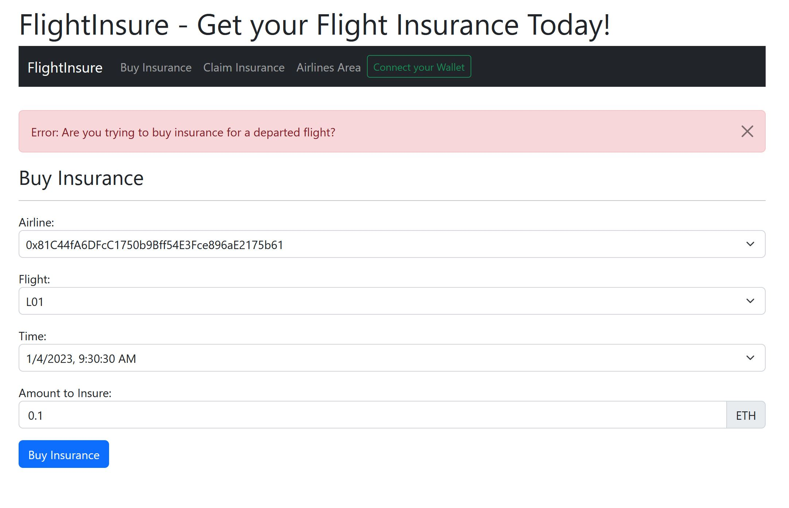
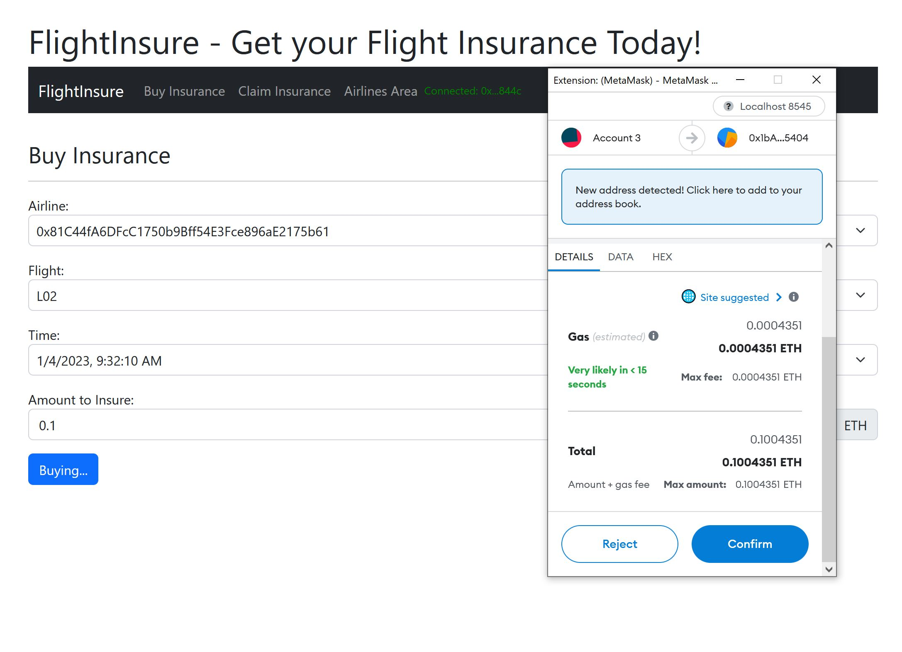
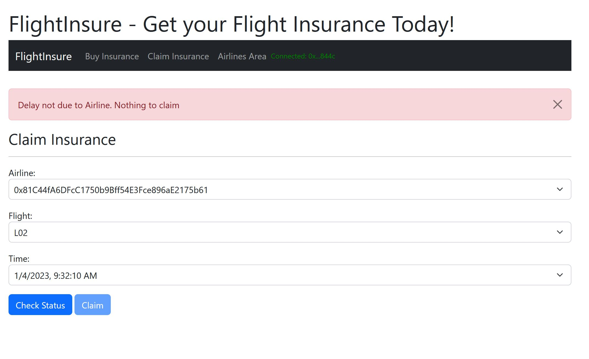

# FlightInsure - Flight Insurance on the Blockchain!

FlightInsure is a basic Flight Insurance Platform for the passengers: 

Buy insurance for your next flight right now with crypto. And claim compensation for any delay by the airline without any hassle. All transactions verified on the Blockchain!

## Getting Started

### Prerequisites  

Libraries used:

I used Truffle smart contract development environment to build this project.

- Truffle v5.6.7 (core: 5.6.7): One of the leading smart contract dev environment
- Ganache v7.7.2: Local testnet for testing
- Solidity - 0.8.17 (solc-js): Latest Solidity compiler
- Node v16.17.0: Node toolchain for truffle framework & frontend dev
- Web3.js v1.7.4: Web3 library to interact with deployed smart contracts
- @openzeppelin/contracts 4.8.0: Openzeppelin contracts for the modules Ownable, Pausable, PullPayment

To build the frontend I used:

- svelte: 3.52.0 using vite: 3.2.3
- svelte-navigator: 3.2.2

### Download

You can clone this repository using __Git__:
```bash
git clone https://github.com/sangeetkar/FlightInsure
```

### Quick start

```bash
# Install dependencies for server
npm install

# Install dependencies for client
npm run client-install

# Install truffle suite
npm i -g truffle

# Use truffle to compile the contracts
truffle compile

# Run Ganache with 50 accounts
ganache -a 50

# Run test cases
truffle test

# Deploy the contracts on Ganache
truffle migrate --reset

# Important: Run the server before the Client
# It will also generate sample flight data to be used by the dApp 
npm run server

# Run the dApp
npm run dapp

# Server runs on http://localhost:3000 and client on http://localhost:8000

# Import one of the accounts from Ganache into Metamask to interact with the dApp.

```

## Smart Contract Development

> I used the reliable Openzeppelin contracts to pull the following functionalities:

  - Ownable: It enables Contract ownership (and modifiers for access management)
  - Pausable: It enables operational control. The contract can be ___paused___ and ___unpaused___.
  - PullPayment: It enables us to avoid paying the amount directly to user's account and let them withdraw instead.

> The Data & App contracts are separately deployed so that contracts can be upgraded reliably in the future.

  - FlightInsureData: The Data contract has all the smart contract data with access control. Most of the functionalities can only be accessed by the App contract.

  - FlightInsureApp: The App contract has all the application logic. And it calls the Data contract to change state.

  - The App contract can be upgraded in the future (application logic is what gets upgraded usually). And the new contract can be hooked to the Data contract by calling __setApp__ method on the Data contract.

## Frontend

It was exciting to try svelte for frontend coding. The corresponding code can be found in __client/src__ directory.

Screenshots:








